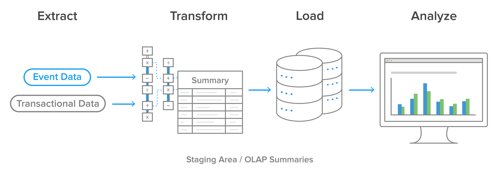
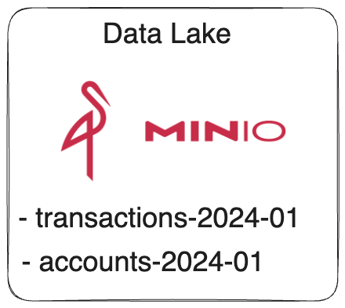
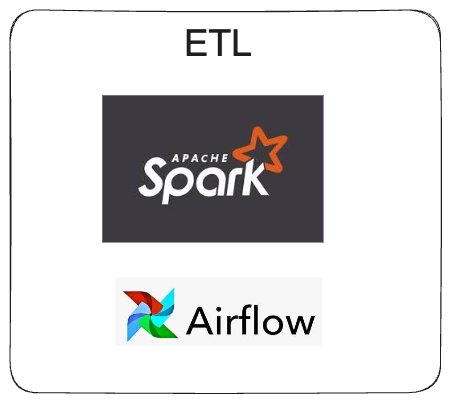
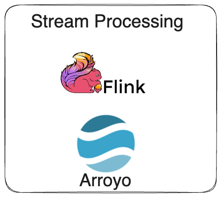
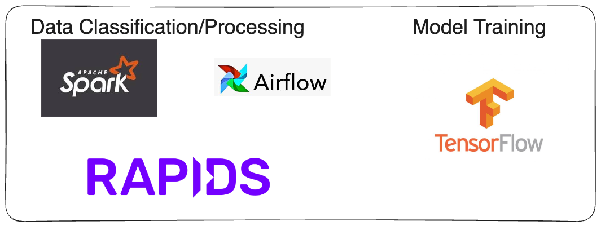
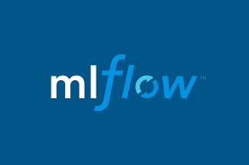
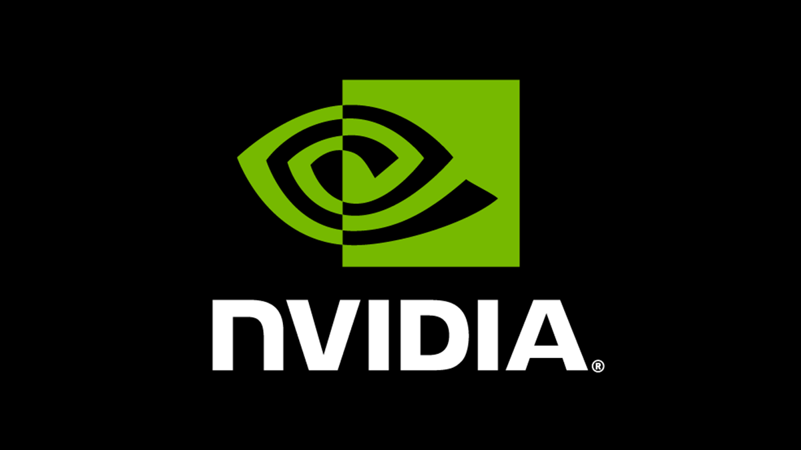
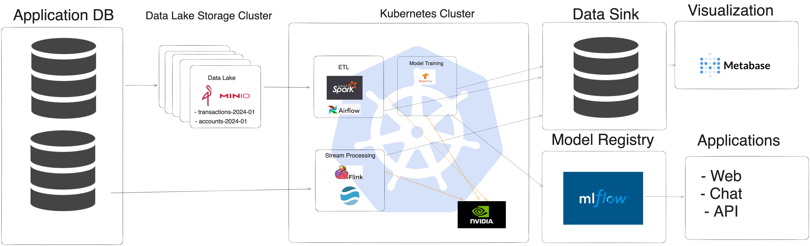

History of Data
---

# Amout of data Collected in software from  2000 to  2024: 

```yaml
Amount of Data
 (Y-axis)
 181ZB|                                                       *  
 147ZB|                                                      **
 120ZB|                                                     ***       
  79ZB|                                          ***            
  64ZB|                                         ***                 
  26ZB|                                  *
  18ZB|                                ***
  15ZB|                               ***
   2ZB|                       *
  50PB|                     ***
  20PB|             *
  10PB|           ***
   5PB| *
   0GB+----------------------------------------------------------> Time (X-axis)
       2000      2005       2010     2015       2020         2024

```

<!-- pause -->
# Trends

<!-- pause -->
-  Exponential growth of data
<!-- pause -->
-  More unstructured data over time
<!-- pause -->
-  Comotidization of data

<!-- end_slide -->

# Trend in  data analysis on software from  2000 to 2024:

<!-- column_layout: [1, 1] -->

<!-- column: 0 -->
<!-- pause -->
-  **2000-2005** Data Warehouse, (RDBMS)SQL classic databases.

Tooling: IBM db2, Oracle, Microsoft SQL Server.

Trends: Structured Data, data silos, BI(buisness intelligence).

Challenges: Limited Scalability, data silos and slow processing times.
---
<!-- pause -->
-  **2006-2010** Emergency of Big Data. Distributed computing frameworks, NoSQL databases.

Tooling: Hadoop (introduced in 2006), Apache Cassandra, MongoDB.

Trends: Handling large volumes of unstructured data, batch processing using Hadoop’s MapReduce, the rise of data lakes.

Challenges: Managing and processing massive datasets, integrating diverse data sources, and ensuring data quality.
---
<!-- column: 1 -->
<!-- pause -->
-  **2011-2015** Big Data Matures and Real-Time Analytics. Batch to real time, adoption of in memory computing.

Tooling: Apache Spark (introduced in 2014), Apache Kafka, Storm, HBase.

Trends: Real-time data processing, streaming analytics, the use of big data analytics for predictive modeling and machine learning.

Challenges: Real-time data integration, scaling analytics infrastructure, and maintaining low-latency processing.
---
<!-- pause -->
-  **2016-2020** Advanced Analytics and AI Integration. Integration of  IA and cloud-based data platforms.

Tooling: Google BigQuery, Amazon Redshift, Microsoft Azure Synapse, TensorFlow, PyTorch.

Trends: AI-driven analytics, the democratization of data analytics with self-service BI tools, and the use of deep learning for complex data analysis.

Challenges: Ensuring data governance, managing AI model interpretability, and handling the ethical implications of AI. Cloud Cost and Data Privacy.
---
<!-- reset_layout -->
<!-- pause -->

-  **2021-2024** IoT, IA and Edge Analytics.

Tooling:  Kubernetes, edge AI devices, real-time streaming platforms like Apache Flink..

Trends: Decentralized data processing, AI-powered insights at the edge, increased emphasis on data privacy and security.

Challenges: Managing distributed data environments, ensuring data security at the edge, and developing robust edge AI models.
---

<!-- end_slide -->

Basic Data Pipeline 
---

<!-- pause -->
# Stages 

Data Collection:
- Applications:
- Forms
- Web
- APIs
<!-- pause -->
ETL:
- Data Cleaning
- Data Transformation
- Data Integration

<!-- pause -->
Visualization:
- Dashboards
- Reports

<!-- pause -->


<!-- end_slide -->

Analytics in Finance
---
<!-- column_layout: [1, 1] -->

<!-- column: 0 -->
<!-- pause -->
# Customer Relationship Management

Applications:
- Managing customer interactions and relationships
- Customer segmentation
- Customer retention
- Customer churn
- Customer lifetime value

Technology: Data Lake, ETL,  Visualization.
<!-- pause -->
# Buisness Intelligence

Applications:
- Finantial Reporting
- Financial Forecasting
- Market Fitting

Technology: Data Lake, ETL, Visualization.

<!-- column: 1 -->
<!-- pause -->
# Risk Management

Applications:
- Fraud Detection
- Fraud Prevention
- Risk Assessment
- Risk Management

Technology: Data Lake, ETL, Stream Processing, ML, AI.

<!-- pause -->
# Regulatory Compliance (RegTech)

Applications:
- Compliance Audits
- Regulatory Reporting
- Regulatory Compliance


Technology: Data Lake, ETL, Stream Processing, ML, AI.
<!-- end_slide -->

Minimal Data Platform 
---

<!-- column_layout: [1, 1] -->

<!-- column: 0 -->
# Data Lake

Unstructured Data migrated from application layer. Usually object storage with minimal metadata files.

# ETL

Tools for data processing focused on processing capacity and performance. 
Should have simple api for data interaction and access to  orchestration tools.

<!-- column: 1 -->
# Stream Processing

It holds  similar value with ETL but is optimized for real time data processing.
Used where action is taken based on real time data and workflow orchestration.


# Visualization

Tools for generating visualizations from data already processed. Need to offer simple interface and options for multiple complex visualizations and analysis.

<!-- reset_layout -->
<!-- pause -->
# AI and ML Platform

Out of ETL and Stream Processing workflows, we add a new layer for AI and ML. AI in data analytics is just another type of transaformation.

- Data classification.
- Models training. 
- Storage for Models.
- Models will be used in workflows to predict and classify data on the stream processing layer, raise alerts and trigger actions for anomaly detection, and many more use cases.

<!-- end_slide -->

Data Platform Stack 
---

<!-- pause -->
# Data Lake
<!-- pause -->

<!-- pause -->
# ETL
<!-- pause -->


<!-- end_slide -->

<!-- pause -->
# Stream Processing

<!-- pause -->


AI and ML Platform

<!-- pause -->
# ETL +  Model Training


<!-- end_slide -->
# Model Registry
<!-- pause -->


# GPU

<!-- pause -->


<!-- end_slide -->
Data Platform  
---
<!-- pause -->


<!-- end_slide -->


#  Caio Rosa

- [LinkedIn](https://www.linkedin.com/in/caio-campos-borges-rosa-392588143)
- [Twitter](https://twitter.com/caiocbrr)
- [GitHub](https://github.com/caiocampoos)
